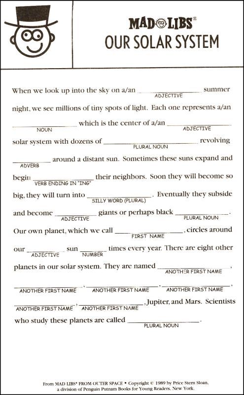

# SP21_assignment2

Let's start putting our objects to good use. In this assignment, we're going to start using object-oriented principles to build a simple word game.  You'll build a collection of objects that work together to solve a problem. We'll also start to make use of memory management tools, as most of our objects will live on the heap. 

Before the Internet and smart-phones, entertainment was much simpler. Trying to be entertained in the back of the family car, on a family vacation to Grandma's house was essential. During those simpler times, Madlibs was a popular game.  Madlibs is a word game with multiple players. One player reads a story (to themselves), in which words have been intentionally left out. As they encounter the missing word, they ask the other players for subtitute words of a given type: "a noun", or "a color", or "a verb".  The other players offer random silly words, and the story gets filled in. At the end, the story is ready aloud with the suggested words, and it can be pretty fun (keep in mind I was under the age of 10 last time I played this game!).



## Overview 

Take a look at the source files in assignment folder:

```
MadLibsController.hpp/.cpp		
MadlibWordProvider.hpp		
MadlibAutoWordProvider.hpp/.cpp
MadlibUserWordProvider.hpp/.cpp	
main.cpp
```

The `MadLibsController` class is used to control the process that occurs when you run your app. You can see this at work in the `main.cpp` file, in two testing methods: `testUserMadLibs` and `testAutoMadLibs`. In these methods, a collection of objects are constructed and connected, so that they can perform the task(s) specified in this assignment. 

The `MadlibsController` class directs your objects to do the following:

1. `readFile(const char *aFilename)` - Read the madlibs template file
2. `runStory(const char *aFilename, MadlibWordProvider &aProvider, std::ostream &anOutput)` - Iterate all the words, and find CAPITALIZED words
3. `getSubstitutes(MadlibWordProvider &aProvider)` - Ask a `MadlibsWordProvider` object to provide a substitute word of a given type for each of the CAPITALIZED words
4. `showFinishedStory(std::ostream &anOutput)` - Print the resulting story (with substitute words) on the given output stream so we can see it.
5. `std::vector<std::string> getWords();` - This function should return the protected member `words`. Note: the data type returned by this function (and the type of `words`) is `std::vector<std::string>`. The `std::vector` is provided by the `#include<vector>` and is part of something called the C++ Standard Template Library (STL). For now, you can think of this vector as a class that provides you with a much easier to use array. The type of the array elements is provided within the `<` and `>` -- so this function returns an array of strings!

The `MadlibWordProvider.hpp` is the base class for the process of choosing word-substitutions in your madlib. Each substitute word will have a type (e.g. _noun_, _verb_, _adjective_, _color_, _and so forth_...). If the madlib file requires a "NOUN", it asks a `MadlibWordProvider` (or a subclass) to suggest the word.  
The `MadlibUserWordProvider` class will simply pass that request on to your user - gathering user input on the command line whereas The `MadlibAutoWordProvider` class is an automatic word generator that makes word suggestions on its own -- without human intervention.  We have provided you with the base class `MadlibWordProvider`, you will complete two classes (`MadlibUserWordProvider` and `MadlibAutoWordProvider`) that each inherit from this base class.

## Encapsulation 

By encapsulating our classes, we gain the ability to think about what they do and how they work, without worrying that users of our class can unintentionally depend on our implementation details. All of your classes encapsulate their member data. Only an instance of each class can directly access it's members. Each class offers a very small interface (set of public methods) to control the object. 

## Inheritance 

We use `inheritance` in this solution to provide multiple types of `MadlibsWordProvider` sub-classes. The first sub-class, `MadlibsUserWordProvider` will ask the user for a word of a given type.  In contrast, the `MadlibsController` class will store each of the words provided by your user, and later substitute those words into the madlib template for everyone to read and enjoy.  

The second sub-class of `MadlibsWordProvider` is the `MadlibsAutoWordProvider` class. Instead of asking the user for a word, objects of this class will automatically choose a word of the given type at random(Like a chatbot). 

## Polymorphism

Polymorphism is used in this assignment when different types of `MadlibsWordProvider` objects are asked for a substitute word. Your `MadlibsUserWordProvider` will respond much differently (by asking a user) than will your `MadlibsAutoWordProvider` (which automatically makes a suggestion). In either case, the `MadlibsController` will call your method, `getSubstituteWord(WordType)`, and the given word-provider object will figure out how to respond.

## Part 1 -- `MadlibsController`

The main logic for your code lives in the `MadlibsController` method, `runStory()`.  Here the `MadLibsController` object begins by reading template file, and scans the text looking for CAPITALIZED words. For each CAPITALIZED word it finds, it will send the message, `getSubstituteWord` to an appropriate `MadlibWordProvider` object. That object will get a substitute word, and return it to the `MadLibscontroller` object.  After all the words in the madlibs1.txt file have been processed, the `MadLibsController` object will then send itself the message, `showFinishedStory()` to reveal the resulting madlib.  

### Reading the madlibs file

The process will begin when your `controller` object reads the given madlibs template file. You should look at the madlibs1.txt file to see how it is formatted. You'll notice that some words are CAPITALIZED.  These words need to be substituted to complete the game.  Make sure you have properly set the path madlibs1.txt file inside your project folder, where it can be read (do this in `main.cpp`).  You MUST use a `filestream` to open and read the contents of the madlibs file. You can read a word at a time, or a line at a time, whichever makes sense to you.

### GetSubstitutes

Each CAPTITALIZED word in the madlibs file prepresents the type of word (e.g. NOUN, VERB, etc) you are expected to get from your `MadlibWordProvider` object.   In the `MadLibsController::getSubstitutes` method, the controller will call a `MadlibWordProvider` object (i.e. `MadlibUserWordProvider` or `MadlibAutoWordProvider`) to request a word of a given type (noun, verb, etc.).  The `MadLibsController` will continue to get word substitutions from the `MadlibWordProvider` objects until all the CAPITALIZED words have been seen.  You have to write the logic to control this process. 

### Showing the finished story

When the `MadLibsController` is done requesting word substitutions, it will automatically print your story to the terminal when it is ready. It does so by calling the method, `showFinishedStory(std::ostream &anOutput)`. You must implement this method yourself. 

## Part 2 - Build the `WordProvider` classes

`MadlibAutoWordProvider/MadlibUserWordProvider` are simple objects. They offer one main method, `getSubstituteWord(WordType)`, which accepts a word-type, and returns a word of that type back to the caller. Each of the `WordProvider` classes does this job a little differently. You have to write the logic for these objects yourself.

### 2a -- Getting substitute words from the user

As the `MadLibsController` finds CAPTITALIZED words in the madlibs template, it will call an available `MadlibUserWordProvider` class, and send it the message, `getSubstituteWord(type)`.  The class should display a prompt to the user on the command line, asking for a word of the given type:

```
Please enter a/an noun: 
```

Wait for the user to input a string, and return the user-provided word from the method. 

### 2b -- Getting substitute words from the automatic word generator

Next you will implement the class `MadlibAutoWordProvider` found in your project folder. This class is also a subclass of the `MadlibWordProvider` class, also found in your project. Rather than asking the user for input, your bot will select a word at random, based on the type of word being requested. The controller will ask your bot for words using the `getSubstituteWord(WordType)` method. This class uses a database of words provided as a JSON file, `words.json`. We have already written funcntions in this class that opens the file and populates a vector of structs for you with the fields of the JSON file.   You will need to use this vector of structs to randomly select a word of the correct type.


## Part 3 -- Testing

This assignment has two built-in tests in your `main.cpp` file: `testUserMadLibs` and `testAutoMadlibs`. Some of the logic is provided for you, but you must complete the code within this file.

In the `testUserMadLibs`, your `MadLibsController` will use a `MadlibsUserWordProvider` object to ask the user for substitute words. For the `testAutoMadLibs`, the `MadLibsController` will call an instance of the `MadLibsAutoWordProvider` class, so your bot can suggest words automatically.

We also have a serier of autograder tests. These may be very helpful in incremently testing each of your classes. They allow you to implement and test the three classes that are the majority of this assignment in any order.  The tests are here:
https://github.com/vgiljaClasses/SP21_assignment2_ag_tests


## FAQ

1. **You only need to implement a subset of the methods across the classes.** Some methods have already been implemented for you. You may want to (and likely should) add data structures to some classes to simplify implementation. To complete this assignment, you don't need to add methods beyond the ones defined in the hpp files, but you are welcome to do so if such additions simplify your implementation!

1. **Plural Nouns.** You simply need to add an "s" to the end of nouns. This might result in some silly english language errors (e.g. mouses), but this is all we are looking for on this assignment.

1. **Autograder tests for MadLibsController:**  This test matches based upon non-white space tokens, line by line (so grouping of letters and punctuation will need to match, and need to be on the correct line and in the correct order, but must have at least one white space character per group). Note: The blank lines in the original file should also appear as blank lines in the output (whitespace characters are OK). 
   1. All the following will be equivalent:
      1. "adjective files. Sometimes the missions are far more"
      1. "adjective          files. Sometimes the missions are far more"
      1. "adjective files.       Sometimes the    missions are far more"
      1. "    adjective files. Sometimes the missions are far more"
      1. "adjective files. Sometimes the missions are far more "
   1. But these will be different:
      1. "adjective files. Sometimes the missionsare far more"
      1. "adjective files Sometimes the missions are far more"
